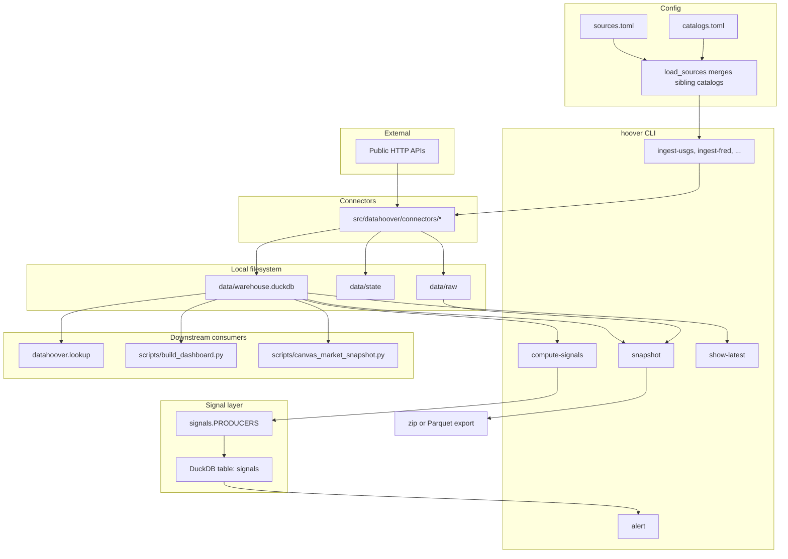
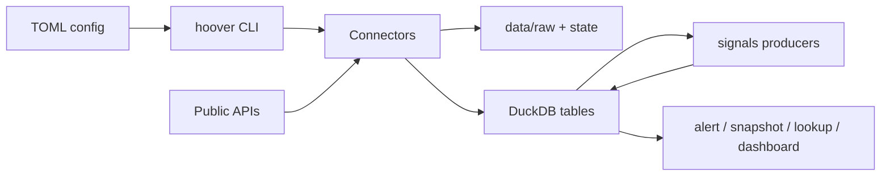
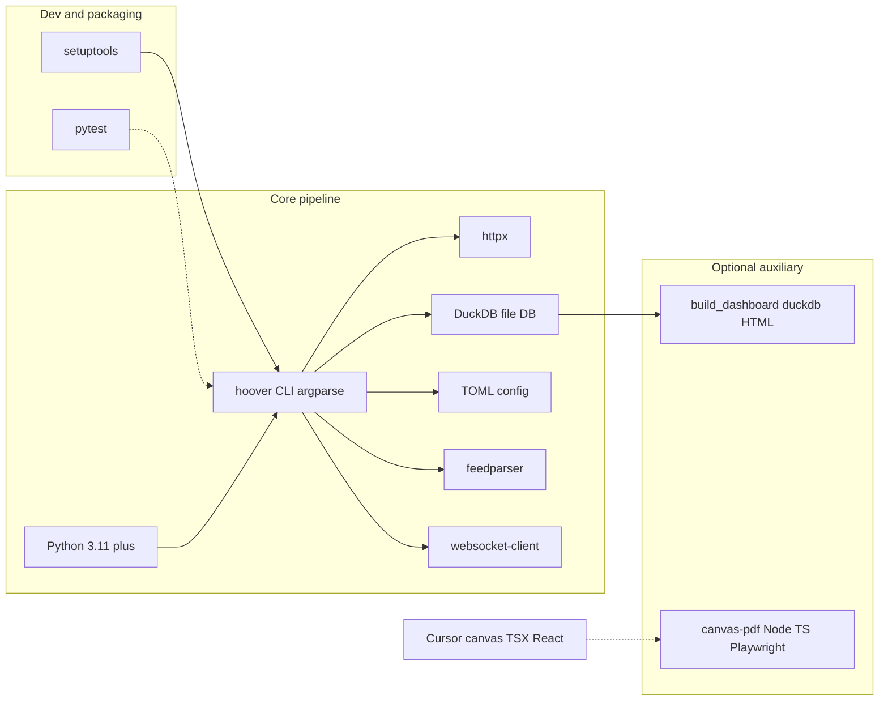

# DataHoover architecture

**Repository:** [github.com/aRealGem/DataHoover](https://github.com/aRealGem/DataHoover)

This page describes how configured **sources** in [`sources.toml`](../sources.toml) (auto-merged with [`catalogs.toml`](../catalogs.toml) for catalog endpoints) flow into **signal producers** in [`src/datahoover/signals.py`](../src/datahoover/signals.py), the unified **`signals`** table, and what you can run or export today. It is plain Markdown so it renders the same everywhere (IDE, GitHub, etc.).

## Architecture diagram

End-to-end flow (config → ingest → DuckDB → signals → consumers):

Layers-only variant (slides):

To export as PDF or image, paste either diagram into [mermaid.live](https://mermaid.live) (Actions → Download SVG/PNG) or use [`@mermaid-js/mermaid-cli`](https://github.com/mermaid-js/mermaid-cli) (`mmdc`).

## Tech stack

See [`pyproject.toml`](../pyproject.toml) for dependency versions.

| Layer | Choices |
|-------|---------|
| Language | **Python 3.11+** |
| Packaging | **setuptools**; console script **`hoover`** → `datahoover.cli:main` |
| CLI | **`argparse`** in [`src/datahoover/cli.py`](../src/datahoover/cli.py) |
| HTTP | **httpx** |
| Database | **DuckDB** (`data/warehouse.duckdb`; [`src/datahoover/storage/duckdb_store.py`](../src/datahoover/storage/duckdb_store.py)) |
| Config | **TOML** — `tomllib` / **tomli**; `sources.toml` + merged `catalogs.toml` |
| RSS/XML | **feedparser** |
| Streaming | **websocket-client** (e.g. RIPE RIS Live) |
| Secrets | `.env` where required by connectors |
| Tests | **pytest** (optional dev extra) |
| Static dashboard | [`scripts/build_dashboard.py`](../scripts/build_dashboard.py) — **vanilla JS** in template HTML, **Plotly** + **Leaflet** via CDN (not React) |
| Cursor canvases | **React** `.canvas.tsx` + `cursor/canvas` — analytic canvases (e.g. **sharp-runup-bull-market**, Iran war / **market impact** narratives); source files usually live **outside** this repo; [`scripts/canvas_market_snapshot.py`](../scripts/canvas_market_snapshot.py) prints warehouse metrics to paste into a canvas; [`scripts/canvas-pdf/`](../scripts/canvas-pdf/) (Node, TypeScript, Playwright) can render a `.canvas.tsx` to PDF |

The dashed edge is the auxiliary PDF path for Cursor canvases, not part of the DuckDB ingest pipeline.

## Static dashboard vs Cursor canvases

- **Local signals dashboard** — Run `python scripts/build_dashboard.py` to emit `data/dashboard/index.html`. This is a **single static HTML page** with embedded **JavaScript**, **Plotly**, and **Leaflet**. It is **not** a React app.
- **Cursor canvases** — Rich **React** UIs in **`.canvas.tsx`** (JSX, `cursor/canvas`). Examples you may use alongside this warehouse include the **sharp-runup-bull-market** canvas and **Iran war / market impact**–style analyses; exports such as a market-impact **PDF** typically come from the **canvas** toolchain ([`scripts/canvas-pdf/`](../scripts/canvas-pdf/)), not from `build_dashboard.py`.
- **Data bridge** — The warehouse still supplies numbers (e.g. via [`scripts/canvas_market_snapshot.py`](../scripts/canvas_market_snapshot.py) after ingesting Twelve Data + FRED) for you to paste into canvas components as `Stat` / `Table` values.

## Active signal pipelines

Each pipeline is: one or more raw sources → one producer function → rows in `signals`.

### 1. Earthquakes → `_earthquake_signals`

*Severity: `min(1, max(0, (magnitude − min_magnitude) / 4))` for rows at or above `min_magnitude` since the cutoff.*

- `usgs_all_day` — USGS GeoJSON summary, all magnitudes, past day.
- `usgs_catalog_m45_day` — USGS FDSN events (M4.5+, last 24h; query params at runtime).

### 2. Global disasters → `_gdacs_signals`

*Severity from GDACS alert level / color (numeric or green→red mapping), with event-type fallback.*

- `gdacs_alerts` — GDACS global alerts RSS/XML feed.

### 3. Internet outages → `_ioda_signals`

*Severity normalized from CAIDA IODA outage event fields to 0..1. `details_json` is enriched with `ripe_ris_live_updates_in_window` — a count of `ripe_ris_messages` rows whose `timestamp` falls within `[start_time, COALESCE(end_time, computed_at)]`. Severity math is unchanged.*

- `caida_ioda_recent` — BGP-derived outage events (defaults: last 24h).
- `ripe_ris_live_10s` — RIPE RIS Live BGP updates (enrichment only; no separate signal).

### 4. Censorship spike → `_ooni_signals` (`signal_type`: `censorship_spike`)

*Compares current vs prior window per `probe_cc`: requires `total ≥ 10`, `current_ratio ≥ 0.5`, and `(current_ratio − prior_ratio) ≥ 0.3`. Severity is `min(1, current_ratio)`.*

- `ooni_us_recent` — OONI measurement metadata (US; defaults include last 24h, 50 records).

### 5. Fiscal stress → `_worldbank_signals` (`signal_type`: `fiscal_stress`)

*Per country/year from `worldbank_macro_fiscal_wide`: component scores from debt, net lending, revenue, interest; combined `0.4·debt + 0.2·net + 0.2·revenue + 0.2·interest` (each component clamped/scaled in code).*

- `worldbank_macro_fiscal` — World Bank WDI macro/fiscal indicators (multi-indicator, 2020–2026).

### 6. Market moves → `_market_move_signals` (`signal_type`: `market_move`)

*Daily return from last two bars per symbol; signal if `|return| ≥ 2%`; severity `min(1, |return| / 10%)`.*

- `twelvedata_watchlist_daily` — Twelve Data daily bars (ETFs, metals, crypto, FX; requires `TWELVEDATA_API_KEY`).
- `fred_macro_watchlist` — FRED indexes / gold / USD FX crosses; each series emits its own signal (distinct from TD tickers; SP500 ≠ SPY, DEXUSEU ≠ EUR/USD).
- `fred_crypto_fx` — FRED Coinbase BTC/ETH/XMR. When both TD and FRED produce a candidate for the same crypto on the same UTC calendar day, **Twelve Data wins** and the FRED twin is dropped (canonical `entity_id` uses the TD form, e.g. `BTC/USD`). Requires `FRED_API_KEY`.

### 7. Weather alerts → `_weather_alert_signals` (`signal_type`: `weather_alert`)

*Fires when `severity in {"Severe","Extreme"}`. Severity score is the product of three mapped NWS factors clamped to 0..1:*

- *severity: Extreme=1.0, Severe=0.8, Moderate=0.5, Minor=0.3, Unknown=0.5*
- *urgency: Immediate=1.0, Expected=0.75, Future=0.5, Past=0.25, Unknown=0.5*
- *certainty: Observed=1.0, Likely=0.75, Possible=0.5, Unlikely=0.25, Unknown=0.5*

*`entity_type = "ugc_zone"`, `entity_id` = the final path segment of `properties.affectedZones[0]` (or `"unknown"`). Dedupes on `(entity_id, ts_start)` where `ts_start = COALESCE(effective, sent)`.*

- `nws_alerts_active` — National Weather Service active alerts (weather.gov).

### 8. Disaster declarations → `_disaster_declaration_signals` (`signal_type`: `disaster_declaration`)

*Fires on every row with `declaration_date >= cutoff`. Severity prior is taken from `declaration_type`: `DR` (Major Disaster) = 0.8, `EM` (Emergency) = 0.5, `FM` (Fire Management) = 0.3; anything else falls back to 0.4. `entity_type = "fema_declaration"`, `entity_id = femaDeclarationString` (stored as `declaration_id`).*

- `openfema_disaster_declarations` — OpenFEMA disaster declarations summary.

## Producer registry

`compute_signals` iterates `signals.PRODUCERS`, a module-level ordered list of `(name, adapter)` pairs. Each adapter has the uniform signature `(con, *, cutoff, computed_at, **config) -> list[SignalRow]` and delegates to the underlying producer function. New producers append to this list in commit order.

## Source contract

[`signals.PRODUCER_SOURCES`](../src/datahoover/signals.py) maps each producer name to the `[[sources]]` entries it consumes. [`tests/test_sources_contract.py`](../tests/test_sources_contract.py) asserts that every source in `sources.toml` is either (a) named in `PRODUCER_SOURCES`, or (b) tagged `purpose = "catalog"` / `purpose = "raw_only"`. Sources tagged `catalog` describe search endpoints for dataset discovery; sources tagged `raw_only` are ingested for manual review but do not currently feed a signal producer.

## Thresholds

Hardcoded thresholds are declared as defaults in `SIGNAL_THRESHOLD_DEFAULTS` (see [`src/datahoover/sources.py`](../src/datahoover/sources.py)) and can be overridden per-type in `[signals.<type>]` TOML blocks inside [`sources.toml`](../sources.toml). `load_signal_thresholds(path)` merges file overrides over defaults so omitting any section yields byte-identical output to the pre-externalization behavior.

| `signal_type` | keys (defaults) |
|---------------|------------------|
| `earthquake` | `min_magnitude = 5.0` |
| `gdacs` | `min_severity = 0.6` |
| `ooni` | `min_total = 10`, `min_current_ratio = 0.5`, `min_ratio_delta = 0.3` |
| `market_move` | `min_abs_return = 0.02`, `severity_denominator = 0.10` |

Precedence (highest wins): `[signals.<type>]` in `sources.toml` → legacy `--usgs-min-mag` / `--gdacs-min-severity` CLI flags → hardcoded defaults. Because the TOML ships with the same numeric values as the pre-refactor defaults, output is byte-identical at the default settings.

## Signals table

All producers write into DuckDB table **`signals`**: 13 columns (`signal_id`, `signal_type`, `source`, `entity_type`, `entity_id`, `ts_start`, `ts_end`, `severity_score`, `summary`, `details_json`, `ingested_at`, `computed_at`, `raw_paths`).

`signal_id` is the SHA-256 hex digest of a **canonical JSON** payload of the row’s identifying fields (see `_signal_id` in `signals.py`), not a separate human-chosen key.

## Outputs that exist today

- `hoover alert` — prints matching signals to stdout (grouped by type).
- `hoover snapshot` — zips `raw/`, `state/`, and the DuckDB file, or writes one Parquet file per table under a stamped directory (see `--format` / `--output` in the CLI).
- Example Parquet path after `hoover snapshot --format parquet`: `data/snapshots/snapshot-<stamp>/signals.parquet`.
- **Static dashboard (local):** after ingesting into `data/warehouse.duckdb`, run `python scripts/build_dashboard.py` to emit `data/dashboard/index.html` (gitignored). The page embeds signals + map/timeline/sparkline context; open the file in a browser. Use `./scripts/run-full-pipeline.sh` for a best-effort full ingest + `compute-signals --since 7d` first.

## Lookup layer for external consumers

Downstream apps (e.g. **TruthBot**) that need **primary-source facts**—a value, provenance, and as-of semantics—can use the read-only Python module **`datahoover.lookup`** on top of the same DuckDB warehouse populated by `hoover ingest-*`. This path is intentionally separate from **signals** (which answer “was there a notable change?”).

- **Module:** [`src/datahoover/lookup.py`](../src/datahoover/lookup.py) — `get_observation`, `get_series`, frozen `Observation` with `as_json_dict()`.
- **Qualified IDs** such as `BLS:LNS14000000`, `FRED:UNRATE`, and `CENSUS:B19013_001E@state:06` disambiguate sources; see **[docs/lookup.md](lookup.md)** for the full table, date rules, and stability guarantees.
- **Starter `raw_only` sources** in `sources.toml`: `bls_truthbot_watchlist`, `census_acs_state_basic`, `eia_petroleum_wpsr_weekly` — ingested for lookup/review; they do not register a signal producer (contract: `purpose = "raw_only"` in [`tests/test_sources_contract.py`](../tests/test_sources_contract.py)).

## Dark sources — ingested, no signal producer wired

These have connectors and tables in [`duckdb_store.py`](../src/datahoover/storage/duckdb_store.py) but **no** corresponding producer in `compute_signals`:

| Category | File | Source names |
|----------|------|--------------|
| Macro & markets (extra / unsignaled) | `sources.toml` | `eurostat_gdp`, `worldbank_gdp_usa` |
| Catalog / discovery | `catalogs.toml` | `datagov_catalog_climate`, `hdx_catalog_cholera`, `socrata_example`, `opendatasoft_example` |
| News | `sources.toml` | `gdelt_democracy_24h` |
| Network measurement | `sources.toml` | `ripe_atlas_probes` |

That is **7** dark sources vs **12** source rows that feed the eight pipelines above (`ripe_ris_live_10s` enriches IODA but is not an independent signal). The merged view across `sources.toml` (16 blocks) and `catalogs.toml` (4 blocks) still totals 20.

### Catalog split

Catalog sources describe dataset-search endpoints (CKAN `package_search`, Socrata SODA discovery, Opendatasoft Explore catalog) rather than substantive data feeds. They live in `catalogs.toml`; [`load_sources`](../src/datahoover/sources.py) transparently merges any sibling `catalogs.toml` at load time, so `hoover ingest-ckan` / `ingest-socrata` / `ingest-opendatasoft` keep finding the same names without any new CLI surface.
